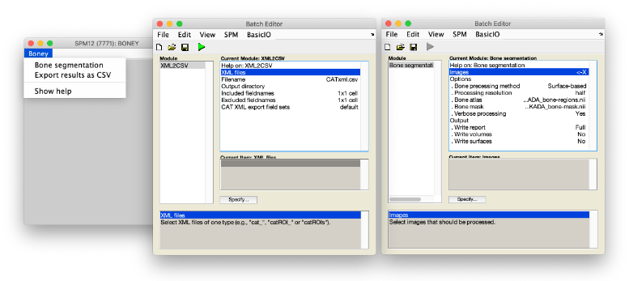
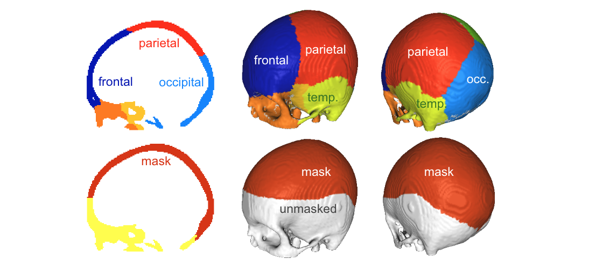
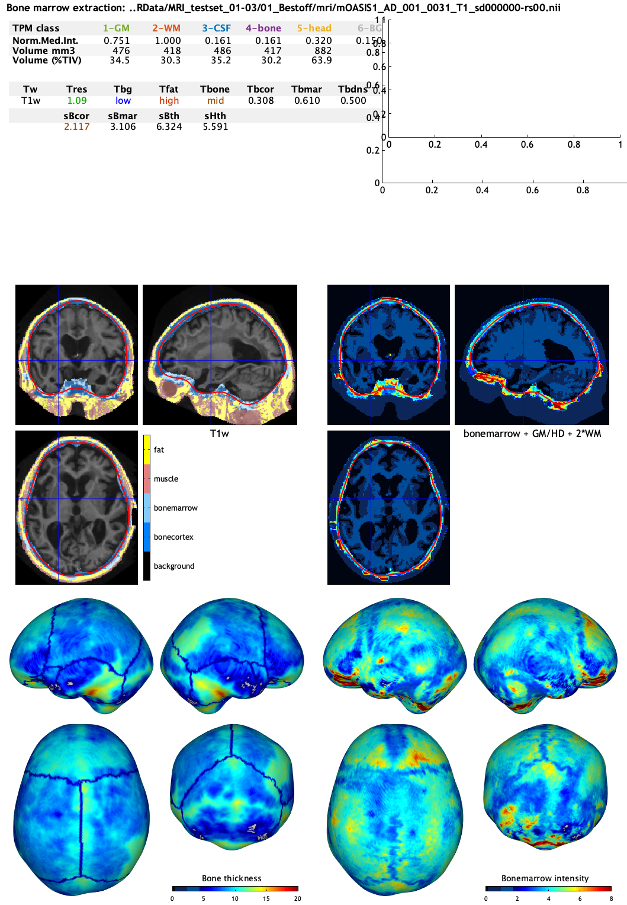
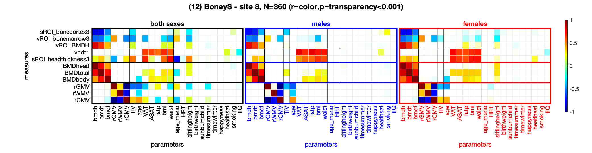
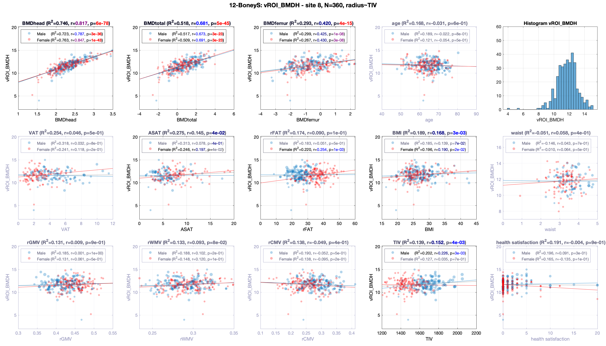
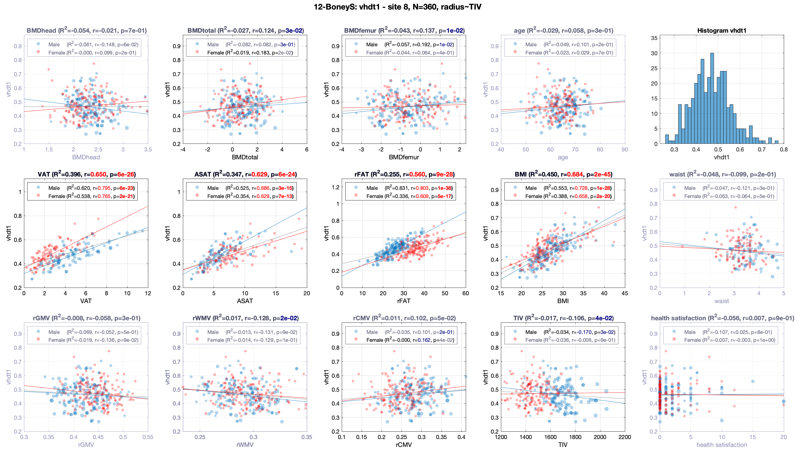
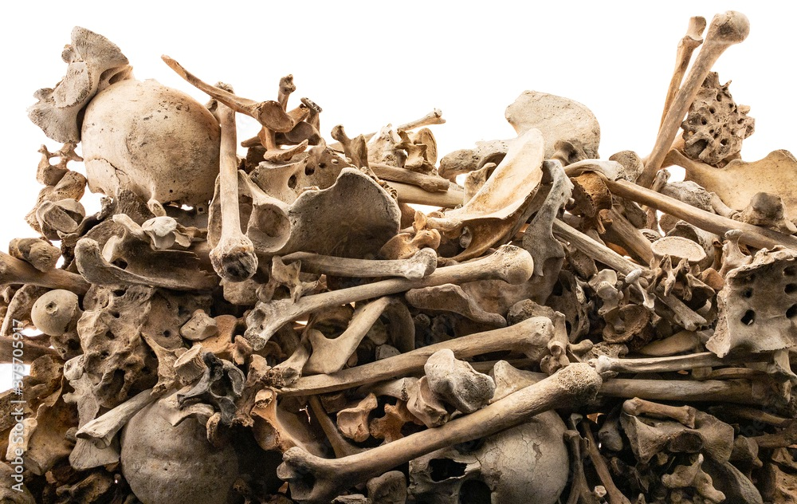

# Boney
This is the Boney toolbox, an extension to [SPM12](http://www.fil.ion.ucl.ac.uk/spm/software/spm12/) and its [CAT12](http://www.neuro.uni-jena.de/cat) toolbox, supporting the extraction of measurements related to the bone and head structure. It is developed by *Polona Kalc* and *Robert Dahnke* and is a free but copyright software, distributed under the terms of the <em>[GNU General Public License](http://www.gnu.org/licenses/gpl-2.0.html)</em> as published by the Free Software Foundation; either version 2 of the License, or (at your option) any later version.

If you find any bugs, please report them to <polona.kalc@med.uni-jena.de> or <robert.dahnke@uni-jena.de>.

## Introduction 
As Ingmar Bergman posited in The Seventh Seal: *'A skull is more interesting than a naked woman.'* Yet the neuroimaging community has continued to strip the skull and discard the relevant information hidden in the layers of the head tissues. 
The increasing interest in the bone-brain crosstalk suggests the implication of bone metabolism in mood, cognition, energy homeostasis, etc. ([Khrimian et al. 2017](10.1084/jem.20171320); [Nakamura, Imaoka, and Takeda 2021](https://doi.org/10.1080/00207454.2020.1770247) ; [Obri et al. 2018](10.1038/nrendo.2017.181); [Rousseaud et al. 2016](https://doi.org/10.1515/hmbci-2016-0030)). Furthermore, low bone mineral density (BMD)/osteoporosis has been associated to an increased risk of Alzheimer's disease ([Kostev, Hadji, and Jacob 2018](https://doi.org/10.3233/JAD-180569); [Zhang et al. 2022](https://doi.org/10.1016/j.jamda.2022.07.012); [Xiao et al. 2023](10.1212/WNL.0000000000207220)).
However, the bone mineral density measures are typically not available in open-access brain-imaging databases, such as IXI, ADNI, AIBL, OASIS, etc. We therefore decided to extract a proxy measure for head BMD from the skull. 

## Quick method
To extract bone parameters from MRI data, we use a refined SPM tissue segmentation procedure and derive different cranial intensity and thickness measures that can be used to approximate the head BMD measure.
An estimation of the head's skin-fold (subcutaneous fat thickness) is also available and can be used as an additional information to the typically available BMI measure.

## Quick start
Install Matlab/Octave, [SPM12](http://www.fil.ion.ucl.ac.uk/spm/software/spm12/) and its [CAT12](http://www.neuro.uni-jena.de/cat) toolbox.
Download the zip-file and unpack it into your SPM12 toolbox directory. 

Run SPM and open the toolbox:

<code>spm fmri; spm_boney;</code>

Open the bone processing batch: 

and select the structural images that should be processed. Adapt relevant parameters (see paragraph Parameters and SPM batch help) and start the processing. Voilà! 

After the processing has finished, you can use the XML2CSV batch to extract the estimated (bone) values for further analyses.

## Parameters
You can select different predefined SPM and CAT segmentation routines with various predefined settings. 
SPM's routine is faster but may fail in some cases, often because of the inital affine registration problems. 

In addition, you can select between different advanced processing routines for the bone measures (e.g., *SPMmat*, *volume*, *surface*).  
SPMmat focuses on the tissue values estimated within the unified segmenation process and is therefore pretty fast (+5 seconds). 
The *volume* option further refines the bone tissue segment (high bone marrow intensities within the diploë were often misclassified as head tissue) and estimates (regional) intensity and thickness of the bone class (+50 seconds). 
The *surface* pipeline creates a central bone surface that is used to extract intensity- and thickness values for (i) the bone cortex by mapping the *minimum* intensity along the surface normals, and (ii) the bone marrow by using the weighted average intensity (+10 seconds).   
(We would advise the use of the refined measure, which is robust to the exclusion of the parts within the diploë.)

Furthermore, you can specify which output files to write, e.g., the short bone-report (as a JPG), or the processed NIFTI volumes or GIFTI surfaces that are also shown in the bone-report.

## Results
For each subject Boney writes a report file and a mat file that include all processed values.  While processing, the major measure of the just processed subject are promted on the command line.  The parameters are group by processing aspects listed in table #.  The T* paramter are derived from the SPM/CAT preprocessing and code major information about the given input MRI.  The following mean thickness (th) or intensity parameters were created volume- or surface-base (v/s) in the masked occiptial-region of the head (H), bone (B) cortex (cor), marrow (mar) or full structure (see table).  Intensity-based measures were normalized for CSF intensity but depend strongly on the protocol.

Table: Command-line and report abbreviations: 
| nr | parameter  | content |
| -: | ---------- | --------| 
|  1 | Tw         | MRI image weighting (T1w, T2w, PDw, MTw, IRw) |
|  2 | Tbg        | Backgound intensity (e.g. low in MPRage, high in many MP2Rage, MT, R1 protocols |
|  3 | Tfat       | Use of fat suppression protocol that reduces the bone (marrow) intensity that is affected by fat | 
|  4 | Tres       | RMS resolution quality measure, i.e. weighted-average resolution in mm (lower=better) | 
|  5 | Tcnr       | Contrast-to-noise ratio to roughly quantify image quality and presents of motion artifacts (lower=better)|
|  6 | v/sBmar    | Volume/surface-based bone marrow measure |
|  7 | v/sBcor    | Volume/surface-based bone cortex measure (~bone mineral density) | 
|  8 | v/sBth     | Volume/surface-based bone thickness (marrow and cortex) |
|  9 | v/sHth     | Volume/surface-based head thickness (fat muscles) |
| 10 | v/sHmed    | Volume/surface-based head intensity (median of all voxel-values, protocol dependent!) |
| 11 | Tbcor      | SPM-based bone cortex intensity - the minimum of the typically 3 Gaussians of the unified segmentation (basic measure only for debugging/tests/comparison) |
| 12 | Tbmar      | SPM-based bone cortex intensity - the maximum of the typically 3 Gaussians of the unified segmentation (basic measure only for debugging/tests/comparison) |
| 13 | Tbdns      | SPM-based bone density - volume-ratio between SPM minimum and median Gaussian (expert, only for comparison) |
| 14 | Tmed(c)    | Volume-based (classic) median bone intensity of the corrected bone (expert, only for comparison) |

In addition, a csv-table of the most relevant measures (including tissue volumes) for all subjects is created at the end of the processing. The csv-export batch can be used to create independent table of previously processed data by selecting the XML-reports of interest. 

Table: Major XML report fields:
| struct | group    | function   | content |
| ------ | -------- | ---------- | --------| 
| set8t  | SPM      | boney_segment_get_segmat | The main field "seg8t" includes single values from the SPM preprocessing used by SPM12, CAT12, or CTseg. |
| tis    | SPM      | boney_segment_get_segmat | The main "tis" structure inlcudes SPM-based measures (seg8*,WMth) image resolution (res_*) and major image class values (WM,GM,CSF,bone[cortex|marrow],head,background).
| tismri | vol      | boney_segment_evalSPMseg | 

Table: Detailed XML report fields:
| struct | group    | parameter    | content |
| ------ | -------- | ------------ | --------| 
| set8t  | SPM      | Affine       | Affine transformation matrix from individual to (MNI) template space. |
| set8t  | SPM      | lkp          | Gaussians for each TPM class. | 
| set8t  | SPM      | wp           | - | 
| set8t  | SPM      | mg           | Weighting within each TPM class defined by lkp. | 
| set8t  | SPM      | mn           | Gaussian peak value of each TPM class define by lkp. |
| set8t  | SPM      | vr           | Variance of each Gaussian peak value of each TPM class define by lkp. |
| set8t  | SPM      | ll           | Final total log-likelyhood of the SPM preprocessing. |
| tis    | SPM      | seg8o        | SPM seg8 main tissue intensity (mn of max mg in lkp). |
| tis    | SPM      | seg8ov       | SPM seg8 main tissue variance (vr of max mg in lkp). |
| tis    | SPM      | seg8n        | SPM main tissue intensity (mn of max mg in lkp) normalized by the WM. |
| tis    | SPM      | seg8nv       | SPM main tissue variance (vr of max mg in lkp) normalized by the WM. |
| tis    | SPM      | seg8con      | Minimum brain tissue contrast in SPM seg8t. |
| tis    | SPM      | seg8conn     | Minimum brain tissue contrast in SPM seg8t normalized by the WM. |
| tis    | SPM      | seg8CNR      | Noise estimate as minimum of the WM and CSF variance in percent (similar to BWP). |
| tis    | SPM      | WMth         | SPM WM tissue intensity. |
| tis    | SPM      | res_vx_vol   | Image voxel resolution in mm. |
| tis    | SPM      | res_RES      | RMS voxel resolution. |
| tis    | SPM      | weighting(n) | MRI image weighting (T1w, T2w, PDw, MTw, IRw).  |
| tis    | SPM      | highBG       | RMS voxel resolution. |
| tis    | SPM      | headFatType  | Protocol intensity type of the head based on SPM seg8t values (0-low[<CSV], 1-mid[<WM], 2-[>WM]).  |
| tis    | SPM      | boneIntType  | Protocol intensity type of the bone based on SPM seg8t values (0-low[<CSF], 1-mid[<WM], 2-[>WM]). |
| tis    | SPM      | WM           | Averaged SPM WM intensity. |
| tis    | SPM      | GM           | Averaged SPM GM intensity. | 
| tis    | SPM      | CSF          | Averaged SPM CSF intensity. | 
| tis    | SPM      | bonecortex   | Cortical bone intensity, i.e. "min( seg8.mn( seg8t.lkp==4) )". | 
| tis    | SPM      | bonemarrow   | Cortical bone intensity, i.e. "min( seg8.mn( seg8t.lkp==4) )". | 
| tis    | SPM      | bonestruct   | Ratio between cortical and spongy bone. | 
| tis    | SPM      | bone         | Average bone intensity, i.e. "mean( seg8.mn( seg8t.lkp==4 ) )". | 
| tis    | SPM      | head         | Average head intensity, i.e. "mean( seg8.mn( seg8t.lkp==5 ) )". | 
| tis    | SPM      | background   | Averaged SPM background intensity. | 
| tismri | vol      | TIV          | Total intracranial volume (GM + WM + CSF). | 
| tismri | vol      | vol          | Volume of the SPM tissues classes in mm (probability >.5). | 
| tismri | vol      | volr         | Relative volume of the SPM tissues classes (probability >.5) normalized by TIV. | 
| tismri | vol      | TIV          | Total intracranial volume (GM + WM + CSF). | 
| tismri | vol      | vol          | Volume of the SPM tissues classes in mm (probability >.5). | 
| tismri | vol      | volr         | Relative volume of the SPM tissues classes (probability >.5) normalized by TIV. | 
| tismri | vol      | volfat       | Volume of fat tissue in the masked upper head (simple threshold to separate the head tissues, in mm). | 
| tismri | vol      | volmus       | Volume of muscle-like tissue in the masked upper head (simple threshold to separate the head tissues, in mm). | 
| tismri | vol      | volmusr      | Relative volume of muscle-like tissue in the masked upper head (simple threshold to separate the head tissues). | 
| tismri | vol      | clsQC        | Relation of voxel with high vs. low density within 30 mm distance. | 
| tismri | vol      | int          | Intensity based evaluated tissue classes: (1) GM: median (=tismri.Tth(1)); (2) WM: median (=tismir.Tth(2)); (3) CSF: median (=tismri.Th(3)); (4) bone: kmeans with 3 classes for bone (1) and bone marrow (3); (5) head: kmeans with 3 classes head (1), muscle (2), and fat (3); (6) bg:  median (=tismri.Th(6)). |

Figure: Bonereport with (1) Table 1 with the tissue intensities and absolute/relative volumes, (2) Table 2 with specific bone and head values (see abbreviations for details, (3) a histogram with the major values, (4) two volumes (i) the orignal image with bone and fat overlay and (ii) the normalized bone intensities with GM, WM and head (HD) segment for orientation, and (5) two surface sets (i) with bone thickness (and atlas boundaries) and (ii) the bone marrow intensity.  
Abbreviations: 
Table 1: GM=grey matter, WM=white matter, CSF=cerebrospinalfluid, BG=background, TPM=tissue probability map, Norm.Med.Int.=normalized median intensity.
Table 2: Tw=image weighting, Tres=root mean square resolution rating, Tbg=background type, Tfat=heat fat suppression type, Tbone=bone fat intensity, sBcor=surface-base bone-cortex intensity, sBmar=surface-based bone-marrow intensity, sBth=surface-based bone thickness, sHth=surface-based head thickness.

## Validation
*RD: Show only the main measures for BMD and FAT linked with the processing routines*

The figure shows the results for the selected bone measures estimated on a UKB subsample created by the evaluation scripts.
The most relevant regional bone measures are (i) the occipital surface-based bone cortex estimate *sROI_bonecortex3*, (ii) the occipital volume-based bone marrow estimate *vROI_bonemarrow3*, and the *bone mineral density estimate* (BMD) that show a high correlation to the UKB BMD measures.

In addition, the estimated head fat measure is supported by high correlations with visceral adipose tissue (VAT), abdominal subcutaneous adipose tissue (ASAT), body fat percentage, BMI, and waist measurements of the UKB. 

## References
You can find out more about the bone and skin-fold thickness measures in the paper ...

## Supplement
### Main functions
Concept and overview with main functions and data-flow chart.

Table of Boney functions with **important** subfunctions and major variables ***vars*** (see table #) stored in the boney XML output.
| function      | subfunction               | content                                                    |
| ------------- | ------------------------- | ---------------------------------------------------------- | 
| **boney_segment** | .                     | Main processing function of the ***Bone segmentation*** batch that uses the following subroutines to extract bone and head specific measures. | 
| . | (1) **boney_segment_preprocessing**   | Call of SPM or CAT to prepare the MRI images and tissue segments. |
| . | (2) boney_segment_filenames           | Setup of filenames depending on the selected input files. |
| . | (3) boney_segment_prepare_print       | Prepare command-line output. | 
| . | (4) **boney_segment_get_segmat**      | Get SPM and CAT presprocessing structures (***seg8t*** and ***tis*** values) |
| . | (5.A1) boney_segment_loadMRI          | Load the images and limite the resolution. |
| . | (5.A2) *boney_segment_simpleBone*     | Original prototype processing functino with "classic" bone measures. |
| . | (5.A3) boney_segment_evalSPMseg       | Estimate refined tissue peaks on the given images (***tismri*** values). |
| . | (5.A4) **boney_segment_refineSPM**    | Refine SPM/CAT bone and head classes (high intensity bone tissue is often misslabed as head). |
| . | (5.A5) **boney_segment_extractbone**  | Estimate the bone/head intensity and thickness maps and parameters (***vROI*** values and ***boney_\*.nii*** volumes files). | 
| . | (5.A6) **boney_segment_create_bone_surface**  | Create median bone surface and map meassures (***sROI*** values and  ***boney_\*.gii*** surface files). |
| . | (5.B) **boney_segment_fst**           | Fast processing without refinements just using SPM/CAT parameters. |
| . | (.) .                                 | Prepare and write XML output (***boney_*.xml***). |
| . | (6) **boney_segment_print_figure**    | A lot of code to print a result figure with images and surfaces (***boney_report_\*.jpg***) |
| . | (7) boney_segment_cmdline             | Print results on the command-line. |
| . | (8) boney_segment_cleanup             | Remove temporary data. |
| **boney_xml2csv** | cat_io_xml2csv        | XML to CSV export function of the ***XML2CSV*** batch that calls the (interal) cat_io_xml2csv function. |

